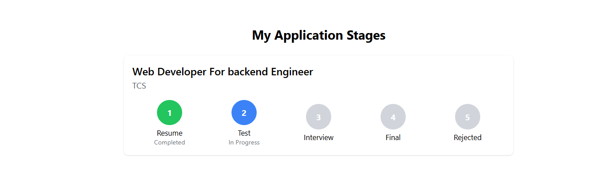
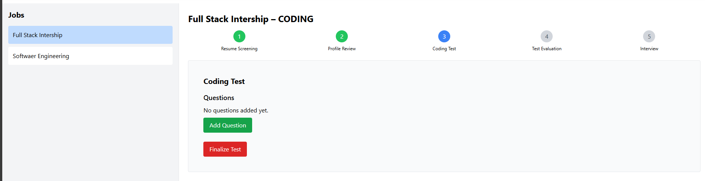

````markdown
# Hiring Project

I developed a full-stack **Hiring Platform** where students can directly connect with companies and apply for jobs.  
The system manages the **entire recruitment workflow** — from job posting to resume evaluation, coding tests, and interviews.  
It integrates an **AI-powered Resume Scoring API** and a built-in **online code editor** for coding assessments.

---

## Table of Contents

* [About the Project](#about-the-project)
* [Features](#features)
* [Screenshots](#screenshots)
* [Technology Stack](#technology-stack)
* [AI Resume Scoring System](#ai-resume-scoring-system)
* [Getting Started](#getting-started)
* [Prerequisites](#prerequisites)
* [Installation](#installation)
* [Project Flow](#project-flow)
  * [Student Flow](#student-flow)
  * [HR Flow](#hr-flow)
* [Future Improvements](#future-improvements)
* [License](#license)
* [Contact](#contact)

---

## About the Project

The **Hiring Project** is a full-stack recruitment system designed to connect students and recruiters.  
It simplifies the hiring process by providing:

* Job posting by HR  
* Student applications with resumes  
* **AI-based resume scoring using NLP (FastAPI microservice)**  
* Online test system with real-time code editor  
* Automated test evaluation using **Judge0 API**  
* Candidate shortlisting for interviews  

This project demonstrates **end-to-end recruitment automation** with both web development and AI integration.

---

## Features

* **User Roles:** Separate portals for Students and HR  
* **Student Profile:** Students create detailed profiles and upload resumes  
* **Job Posting:** HR can create and manage job listings  
* **Application Tracking:** Each student-job pair is tracked with a unique record  
* **Recruitment Stages:**
  1. Resume Submission  
  2. Profile Screening  
  3. Coding Test  
  4. Test Evaluation  
  5. Interview Shortlisting  
* **AI Resume Scoring:** NLP-based FastAPI model calculates resume–JD similarity and stores the score in the database  
* **Code Editor:** Integrated online coding environment using **Judge0 API**  
* **HR Dashboard:** HR can view applicants, scores, and shortlist candidates step-by-step  

---

## Screenshots

### 🧑‍🎓 Student Dashboard


### 👩‍💼 HR Dashboard


### 💻 Home Page


### 📊 Resume Score Analysis


### 📬 Application Status Page


---

## Technology Stack

### **Frontend**
- React  
- Tailwind CSS  

### **Backend**
- Node.js & Express.js  
- MongoDB + Mongoose  

### **AI Resume Scoring System**
- Python (FastAPI)  
- pdfplumber (resume text extraction)  
- SentenceTransformer (MiniLM-L3-v2 for semantic similarity)  
- scikit-learn (cosine similarity computation)  

### **Key Tools & Libraries**
- Judge0 API (for online coding tests)  
- JWT (for authentication)  
- Bcrypt (for password hashing)  
- Nodemailer (for sending test invitations and notifications)

---

## AI Resume Scoring System

A dedicated **FastAPI microservice** evaluates how well a candidate’s resume matches a job description using **Natural Language Processing (NLP)**.

### 🔍 **Working Process**

1. **Resume Extraction:** Uses `pdfplumber` to extract text from PDF resumes.  
2. **Text Cleaning:** Removes special symbols and converts to lowercase for uniformity.  
3. **Keyword Scoring:** Finds matching and missing job keywords.  
4. **Semantic Similarity:** Uses **SentenceTransformer (MiniLM-L3-v2)** to compute the semantic closeness between resume and job description.  
5. **Final Score:** Combines keyword and semantic scores into a single match percentage.

### 📈 **API Endpoint**

**POST** `/score_resume/`  
**Parameters:**
- `file`: PDF resume (UploadFile)
- `job_description`: Job description text

**Response:**
```json
{
  "final_score": 87.45,
  "keyword_score": 82.33,
  "semantic_score": 92.57,
  "missing_keywords": ["react", "mongodb"]
}
````

### 🚀 **Tech Used**

* FastAPI
* pdfplumber
* SentenceTransformer (MiniLM-L3-v2)
* scikit-learn
* Uvicorn

---

## Getting Started

### Prerequisites

* Node.js (v14 or higher)
* MongoDB
* Python (for AI microservice)
* Judge0 API credentials

---

### Installation

1. **Clone the repository**

   ```bash
   git clone https://github.com/gaurav-opensource/Hiring-Platefrom.git
   cd hiring-project
   ```

2. **Setup Backend**

   ```bash
   cd backend
   npm install
   ```

   Create `.env`:

   ```
   MONGO_URI=mongodb://127.0.0.1:27017/hiring-project
   PORT=5000
   JWT_SECRET=your_secret
   JUDGE0_API_KEY=your_judge0_api_key
   ```

   Start:

   ```bash
   npm start
   ```

3. **Setup Frontend**

   ```bash
   cd frontend
   npm install
   ```

   `.env`:

   ```
   REACT_APP_API_URL=http://localhost:5000/api
   ```

   Start:

   ```bash
   npm start
   ```

4. **Run AI Resume Scoring API**

   ```bash
   cd ml_api
   python app.py
   ```

---

### Live Demo / Hosting

The project is hosted on Render for easy access:

* **Live Demo Link:** [Job finder Link](https://hiring-platefrom-frontend-1.onrender.com)

## Project Flow

### Student Flow

* Register and create a profile (upload resume).
* Apply for jobs.
* Solve coding tests in the integrated code editor.
* Track recruitment status.

### HR Flow

* Register as HR.
* Post new jobs.
* Automatically score all resumes via the **AI Resume Scoring API**.
* Shortlist candidates and send tests via email.
* View test results and schedule interviews.

---

## Future Improvements

* Add real-time notifications (Socket.IO).
* Integrate video interviews.
* Enhance resume parsing with advanced NLP (BERT).
* HR analytics dashboard.
* Bulk candidate communication via email/SMS.

---

## Contact

**Author:** Gaurav Yadav
**Email:** [gauravyadavgh@example.com](mailto:gauravyadavgh@example.com)
**LinkedIn:** [linkedin.com/in/gauravyadav](https://www.linkedin.com/in/gauravyadav95/)
**GitHub:** [github.com/gauravyadav](https://github.com/gaurav-opensource)

```

---

